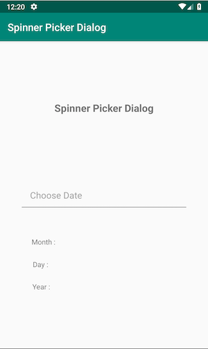
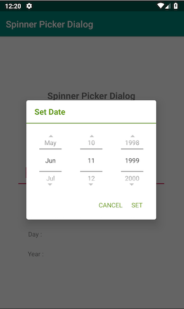
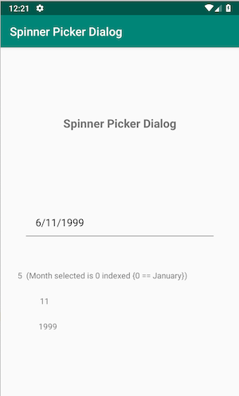
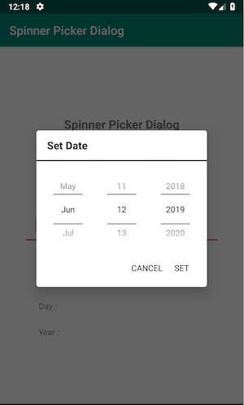

# SpinnerPickerDialog
Date Spinner Picker Dialog





## Feature
* Show date picker with spinner style
* Fully Customizable style

## Contributing

You can do :
* a pull request, or
* raise a an issue ticket, or
* request additional feature by raise a ticket.


## License

What license? 

## Download

Minimum Android SDK Version 16

#### Gradle
**Step 1.** Add it in your root build.gradle at the end of repositories:
```gradle
allprojects {
  repositories {
    ...
    maven { url 'https://jitpack.io' }
  }
}
```

**Step 2.** Add the dependency
```gradle
dependencies {
  implementation 'com.github.anggastudio:SpinnerPickerDialog:2.0.0'
}
```
#### Maven
**Step 1.**
```xml
<repositories>
  <repository>
    <id>jitpack.io</id>
    <url>https://jitpack.io</url>
  </repository>
</repositories>
```

**Step 2.** Add the dependency
```xml
<dependency>
  <groupId>com.github.anggastudio</groupId>
  <artifactId>SpinnerPickerDialog</artifactId>
  <version>2.0.0</version>
</dependency>
```

## Usage
* Show default date picker dialog like this:


```java
final SpinnerPickerDialog spinnerPickerDialog = new SpinnerPickerDialog();
spinnerPickerDialog.setContext(this);
spinnerPickerDialog.setOnDialogListener(new SpinnerPickerDialog.OnDialogListener() {

            @Override
            public void onSetDate(int month, int day, int year) {
                // "  (Month selected is 0 indexed {0 == January})"
            }

            @Override
            public void onCancel() {

            }

            @Override
            public void onDismiss() {
                
            }
            
        });
spinnerPickerDialog.show(this.getSupportFragmentManager(), "");        
```

* Show fully customizable date picker dialog like this (green color):


```java
Calendar maxCalendar = Calendar.getInstance();
maxCalendar.add(Calendar.YEAR, -MAX_YEAR);

final SpinnerPickerDialog spinnerPickerDialog = new SpinnerPickerDialog();
spinnerPickerDialog.setContext(this);
spinnerPickerDialog.setMaxCalendar(maxCalendar);
spinnerPickerDialog.setAllColor(ContextCompat.getColor(this, android.R.color.holo_green_dark));
spinnerPickerDialog.setmTextColor(Color.BLACK);
spinnerPickerDialog.setArrowButton(true);
spinnerPickerDialog.setOnDialogListener(new SpinnerPickerDialog.OnDialogListener() {

            @Override
            public void onSetDate(int month, int day, int year) {
                // "  (Month selected is 0 indexed {0 == January})"
            }

            @Override
            public void onCancel() {
                
            }

            @Override
            public void onDismiss() {
                
            }
            
        });
spinnerPickerDialog.show(this.getSupportFragmentManager(), ""); 
```
